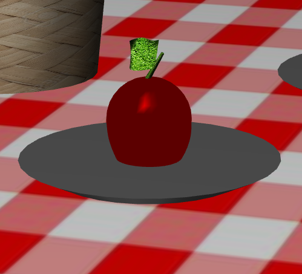
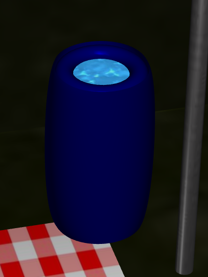
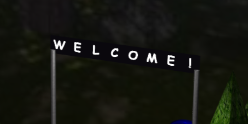
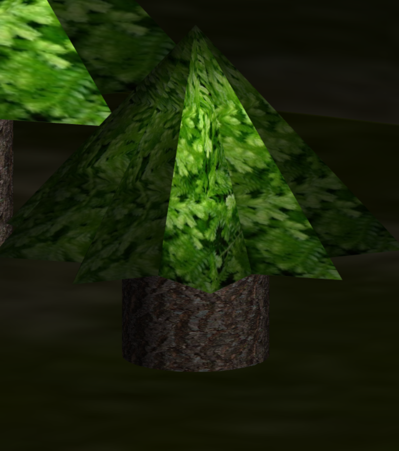
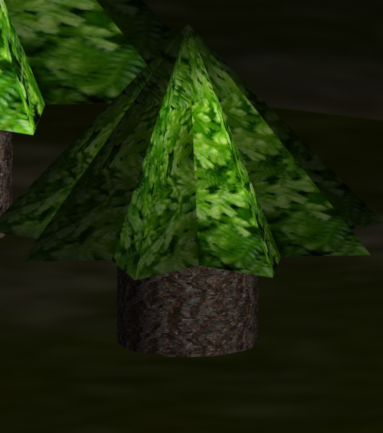
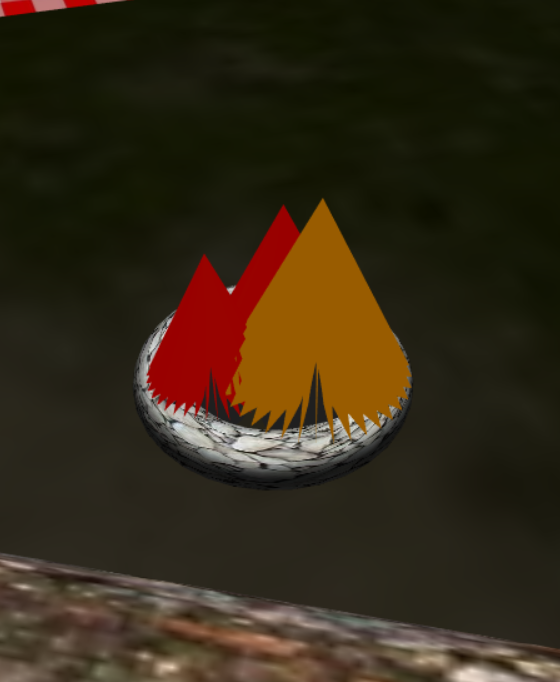
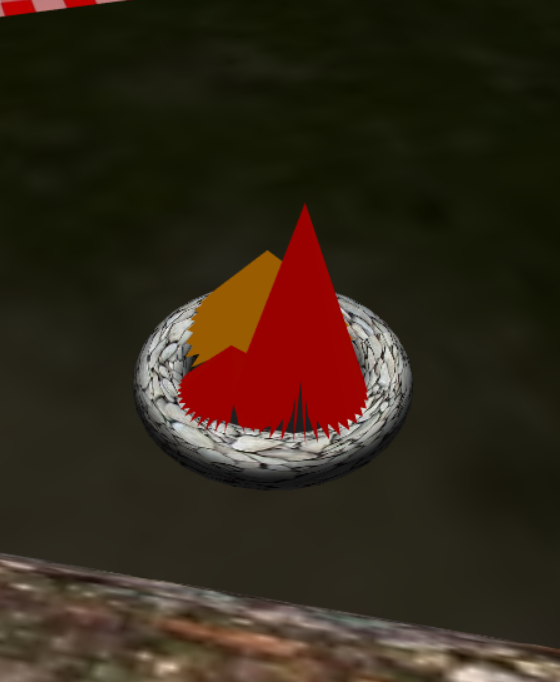

# LAIG 2020/2021 - TP2

## Group T06G02

| Name                       | Number    | E-Mail              |
| ---------------------------| --------- | --------------------|
| Clara Alves Martins        | 201806528 | up201806528@fe.up.pt|
| Beatriz Costa Silva Mendes | 201806551 | up201806551@fe.up.pt|

----
## Project information

- Scene Strong Points
  - Added a barrel of water and an apple to the picnic  
  - Welcome sign 
  - Tree leaves wave with the wind  
  - Fire burns while moving  
- Scene
  - The scene consists of a camp in a forest, in which a welcome sign, tents, logs, and a bonfire are present. There is also a log and a tire serving as seats near the fire and a picnic with an apple and water. 
  - [Link to the Scene](https://git.fe.up.pt/laig/laig-2020-2021/t06/laig-t06-g02/-/blob/master/TP1/scenes/LAIG_TP1_XML_T6G02.xml))
----
## Issues/Problems

- In this project, we managed to complete every single requirement, but some obstacles came up, especially while working with the classes ````MyAnimation```` and ````MyKeyframeAnimation````.
- The first problem was when implementing the interpolations in the ````update(t)```` function. This implementation required knowing if the current keyframe was active or not or if it was coincident with the instant that was passed in the arguments. We had to create some if statements to verify if the keyframe was active, to verify if the instant passed was the same as the keyframe instant to know if we had to some interpolations or, the last scenario, to verify if we should do some interpolations.
- The other problem was dealing with the end of the animation. When the animation was over, sometimes the object wasn't in the required position because we we'rent verifying if the animation was over. To deal with this problem, we had to create an if statement to check if the instant was after the instant from the last keyframe.
- In the end, we were able to surpass all the problems and obtain our scene completely parsed and represented, using animations, spritesheets and NURBS.
